## A origem do problema

Como organizar, de forma rigorosa e replicável, os dados de uma pesquisa qualitativa com centenas de fontes, dezenas de conceitos e relações complexas entre eles?

Essa pergunta acompanhou o mesmo pesquisador por mais de uma década — e cada tentativa de resposta se tornou um degrau na construção do que hoje é a linguagem Synesis.

A linguagem nasceu formalmente em 2026, mas sua história não começou naquele ano. Sua arquitetura, seu vocabulário de domínio e seus requisitos metodológicos resultam de uma trajetória iniciada décadas antes, na qual duas linhas de experiência avançaram até convergir: a prática de desenvolvimento de software e a pesquisa qualitativa. BDM, SocioAtlas, o pipeline de diagnóstico socioambiental, SocioAtlas para Google Sheets e DGT7 não foram projetos desconectados, mas implementações sucessivas de um mesmo esforço. Cada uma resolveu parte do problema, revelou novos limites e deixou componentes conceituais ou técnicos que seriam incorporados ao Synesis.

## Linha do tempo {#sec-linha-do-tempo}

### 1986 — Primeiros contatos com programação

Christian Maciel De Britto começou a estudar informática aos 13 anos. No New York Institute de Belo Horizonte, realizou os cursos Basic I e II e teve os primeiros contatos com **Basic** e noções de **COBOL** — uma linguagem organizada em blocos com delimitadores explícitos de início e fim. Décadas depois, essa forma de estruturar instruções encontraria correspondência na sintaxe do Synesis: `SOURCE ... END SOURCE`, `ITEM ... END ITEM`.

### 1991–1999 — ImageWare Informática: o primeiro software comercial próprio

A descoberta do **dBase II Plus** e do **Clipper** (Autumn 86, Summer 87 e Clipper 5) abriu o caminho profissional e, em 1991, levou à fundação da **ImageWare Informática Ltda.**, empresa da qual Christian foi fundador e CEO. Em Clipper — linguagem orientada a dados e registros — foram desenvolvidos e comercializados dois produtos de software próprios, de titularidade da empresa:

- O **SALA** — sistema de gestão escolar, destinado a dados acadêmicos, notas e históricos;
- O **SAGA — Sistema de Automação de Postos de Combustível**, que chegou a ter mais de cem clientes ativos.

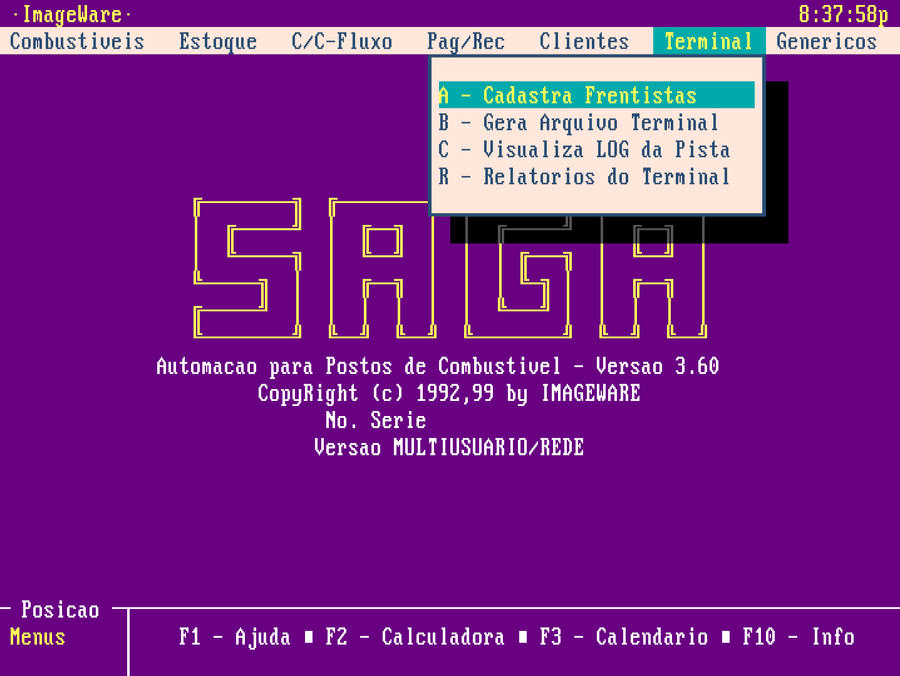

O ambiente de programação Clipper (xBase) e o sistema operacional MS-DOS tiveram papel importante nessa formação intelectual e profissional. [Este artigo apresenta o contexto histórico dessa tecnologia](https://www.linkedin.com/pulse/o-rei-do-dos-hist%C3%B3ria-completa-de-como-clipper-e-perdeu-brandini-bqbff/).

Entre 1995 e 1997, a ImageWare foi incubada na InsoftBH, Incubadora de Empresas de Base Tecnológica em Informática, sediada em Belo Horizonte (MG), com apoio da Sociedade Mineira de Software — [FUMSOFT](https://fumsoft.org.br/) — e da Universidade Federal de Minas Gerais (UFMG). Nesse período, Christian também realizou o curso *Qualidade de produtos de software: normas NBR ISO 13.596 e ISO/IEC 12.119*, ministrado pela MSc. Márcia Silveira de Almeida (UFMG).

Essa etapa consolidou uma experiência que reapareceria no Synesis: conceber, desenvolver e comercializar software próprio — com titularidade intelectual clara sobre os produtos —, modelar domínios reais, organizar dados estruturados e tratar qualidade de software como requisito de sistemas utilizados por outras pessoas.

### 1999 — Mudança de rumo

A atividade comercial da ImageWare foi encerrada em 1999, e o foco se voltou para uma caminhada Cristã, envolvendo estudos e práticas teológicas. O encontro com Jesus Cristo! Uma conversão. Esse realinhamento espiritual, intelectual e profissional alimentou uma sensibilidade hermenêutica, epistemológica e filosófica que, mais tarde, encontraria expressão na aplicação das filosofias de Herman Dooyeweerd e Dirk Vollenhoven, filósofos cristãos holandêses, ao método de pesquisa. Ao mesmo tempo, um sistema de controle financeiro em **Delphi 5**, desenvolvido sem fins comerciais, manteve vivo o vínculo com a prática de programação.

Essa fase aproximou duas dimensões que se tornariam inseparáveis no Synesis: a interpretação rigorosa de textos e conceitos e a construção de instrumentos computacionais capazes de organizá-los.

### 2011–2013 — BDM: o primeiro protótipo

Na dissertação de mestrado [*Sustentabilidade e Intradisciplinaridade*](https://doi.org/10.13140/RG.2.2.10686.10563) (UFPR), dedicada aos impactos socioambientais da indústria parapetrolífera em Pontal do Paraná, surge o **BDM — Banco de Dados Multimodal**.

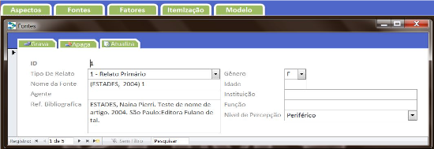

Tecnicamente simples — um front-end em **Microsoft Access 2010** conectado ao **PostgreSQL** —, o BDM era uma solução local e individual. Seu fluxo de trabalho, porém, já continha o embrião do que viria depois: **fontes** classificadas por tipo, **fatores** vinculados a modalidades filosóficas, **itens** relacionados a pares de fatores com nexos positivos ou negativos e geração automática de sumários e grafos de relações.

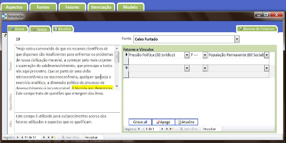

O próprio autor reconheceu uma limitação importante: o BDM permitia apenas pares de fatores por item. A pergunta que ficou em aberto — como representar redes mais ricas de relações sem perder o rigor? — moldou tudo o que veio depois.

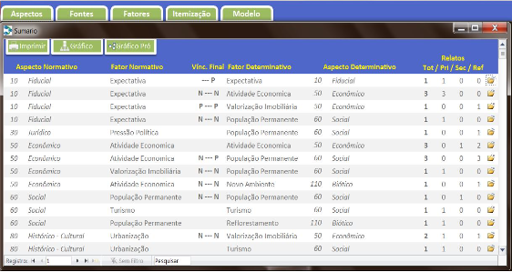

De forma ainda embrionária, o BDM organizava o conhecimento em "blocos" de fontes, itens e ontologia. Ao final, gerava um modelo analítico na forma de grafo de conhecimento, com o uso da [biblioteca GraphViz](https://graphviz.org/).

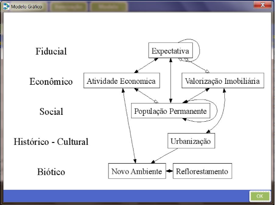

O legado do BDM para o Synesis foi a primeira definição operacional de seu domínio: fontes, itens, fatores, relações, ontologia e grafo de conhecimento passaram a formar uma estrutura integrada.

### 2018 — SocioAtlas: um ecossistema CAQDAS sob medida

Na tese de doutorado [*Pensamento Sistêmico Multimodal*](https://doi.org/10.13140/RG.2.2.26449.17760) (UFPR), a resposta foi mais ambiciosa: o **SocioAtlas**, um ecossistema cujas partes foram desenvolvidas em **Free Pascal/Lazarus**, com banco de dados **Firebird**.

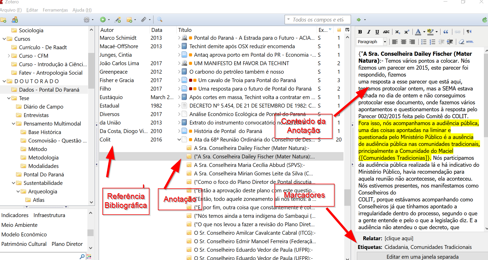

A solução era um CAQDAS (*Computer-Assisted Qualitative Data Analysis Software*) construído sob medida para o Método Sistêmico Multimodal (MSM). Importava dados do **Zotero**, organizava fontes, itens e fatores, vinculava cada fator a uma modalidade e incluía uma camada de georreferenciamento com exportação de arquivos KML para o Google Earth Desktop. A plataforma web *SocioAtlas* tornava os mapas acessíveis ao público.

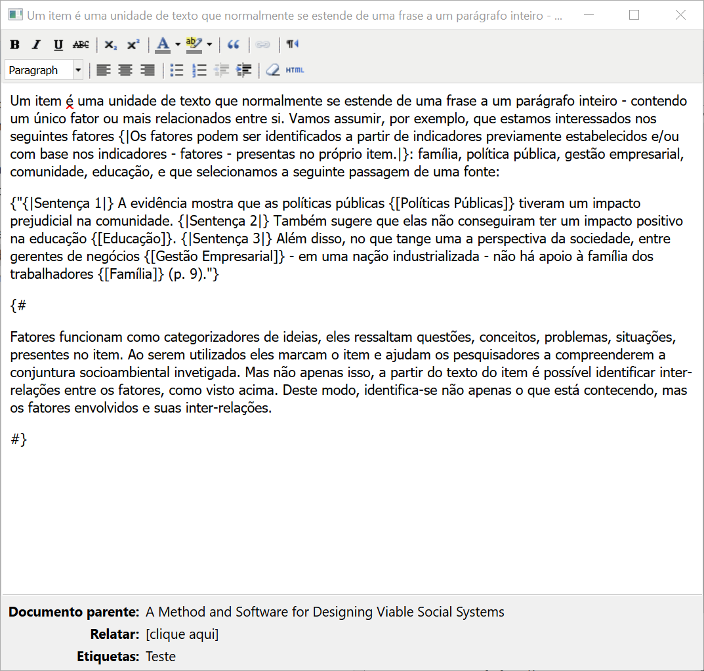

No Zotero, conceitos, comentários e memorandos analíticos eram identificados por meio de um sistema de marcadores criado para a solução. Assim, um conceito como `{[Políticas Públicas]}` podia ser distinguido de um comentário analítico como `{#um comentário analítico#}`. Estas foram as marcações adotadas:

```
{[ ]} - Destaque para conceitos
{! !} - Trilhas de auditoria e memorandos analíticos
{" "} - Citações
{# #} - Comentários gerais
```

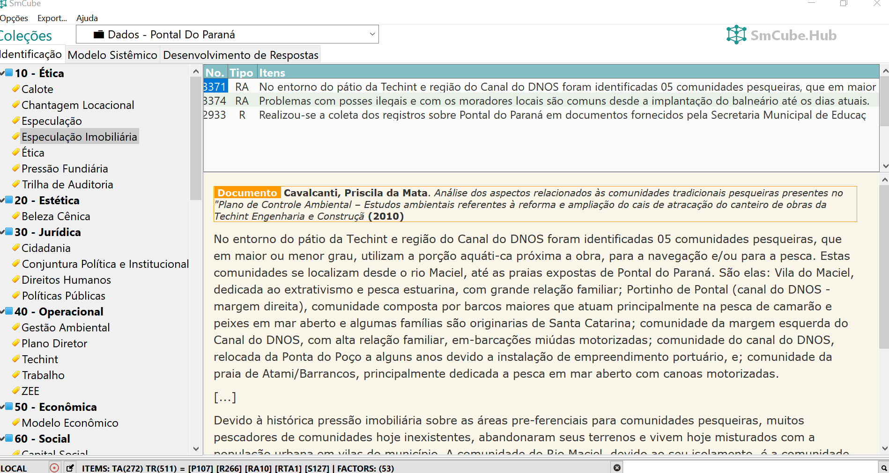

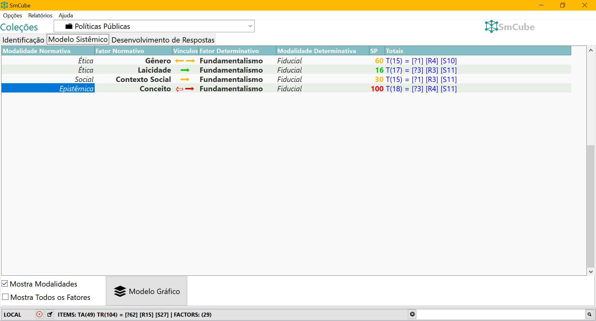

Em relação ao BDM, havia uma inovação importante: a possibilidade de incorporar dados georreferenciados. Daí o nome SocioAtlas.

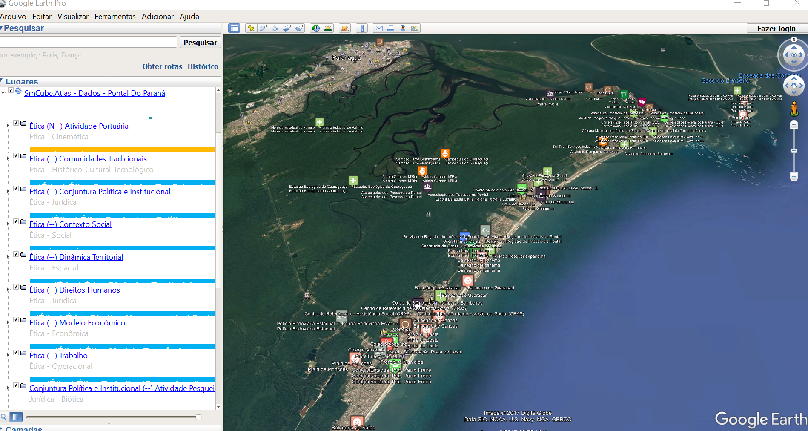

Vários componentes que reapareceriam no Synesis já estavam presentes: fonte, item, fator, trilha de auditoria, integração com Zotero e representação gráfica do conhecimento. O que faltava era **portabilidade metodológica** — a estrutura estava acoplada ao MSM e às suas dezoito modalidades. Adaptar o sistema a uma pesquisa diferente exigia reescrever o software.

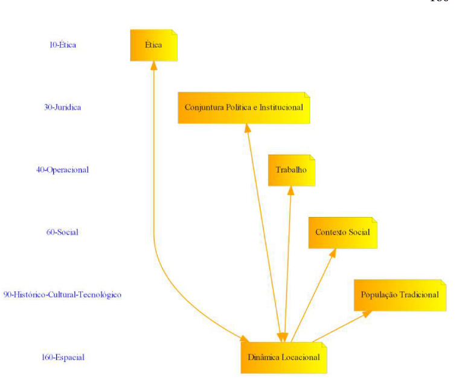

O SocioAtlas ampliou o domínio iniciado no BDM e demonstrou que um ambiente de pesquisa precisava integrar anotações, conceitos, auditoria, ontologia, localização geográfica e visualização. Sua limitação revelou o próximo requisito decisivo do Synesis: permitir que o método fosse configurado sem reprogramar a ferramenta.

### 2019–2020 — Diagnóstico socioambiental: o primeiro pipeline em contexto profissional

Entre 2019 e 2020, como sociólogo em uma consultoria ambiental, surgiu a primeira oportunidade de aplicar os princípios desenvolvidos nas etapas anteriores em um contexto profissional real: um diagnóstico socioambiental participativo de comunidades pesqueiras, conduzido em conformidade com normas federais de licenciamento ambiental.

O desafio era metodologicamente rico e operacionalmente exigente. As equipes de campo coletavam dados por meio de entrevistas semiestruturadas com moradores e lideranças, observação direta e oficinas participativas. O volume de material produzido — transcrições, descrições, fichas de observação — precisava ser transformado em análise estruturada, comparável entre comunidades e auditável.

Para isso foi desenvolvido um **complemento para o Microsoft Word** em **Visual Basic for Applications (VBA)**. O pesquisador selecionava trechos das transcrições diretamente no documento, aplicava marcadores que identificavam o valor de significância do trecho (0, 0,5 ou 1, correspondendo a impacto nulo/baixo, moderado ou alto) e sua categoria na **matriz FOFA** — força, oportunidade, fraqueza ou ameaça. O complemento lia essas marcações e exportava os dados estruturados para uma planilha, onde eram contabilizados por comunidade, tema e dimensão de sustentabilidade.

O pipeline completo compreendia três camadas: a **itemização** — extração de segmentos individuais de texto, cada um contendo uma única ideia — seguida da **codificação temática** com atribuição de categorias FOFA e pontos de significância, e por fim a **visualização** dos dados consolidados em dashboards construídos no **Power BI**, que permitiam filtrar por comunidade, dimensão de sustentabilidade (física e biótica, sociocultural, econômica, infraestrutura e serviços), objetivos de desenvolvimento sustentável (ODS) e categoria FOFA.

O resultado era uma **escala de sustentabilidade local** calculada para cada comunidade, comparável geograficamente por meio de mapa interativo — e integralmente rastreável de volta aos itens originais, que por sua vez remetiam ao corpus textual completo das leituras técnica e comunitária.

O que esse trabalho trouxe para a trajetória do Synesis foi a validação em escala profissional de dois princípios que já estavam presentes no BDM e no SocioAtlas: a **trilha de auditoria** — a cadeia verificável de corpus → item → resumo → tema → pontuação — e a necessidade de que qualquer marcação inválida gerasse erro imediato, não silêncio. Um código de tema digitado incorretamente no Word criava um fator duplicado sem aviso, exatamente o mesmo problema que o DGT7 repetiria anos depois e que o compilador Synesis resolveria definitivamente com validação em *compile-time*. A experiência também demonstrou que a portabilidade metodológica era um requisito real, não teórico: o mesmo pipeline precisou ser adaptado para múltiplos domínios temáticos e contextos comunitários distintos, cada um com sua própria configuração de temas e categorias.

### 2023 — SocioAtlas para Google Sheets

Tanto o SocioAtlas original quanto o pipeline de diagnóstico compartilhavam uma limitação: dependiam de software instalado localmente ou de ambientes profissionais específicos. Por que não reconstruir a essência do método em uma plataforma acessível a qualquer pesquisador, em qualquer lugar? O **SocioAtlas para Google Sheets** — um complemento em **Google Apps Script** publicado no Google Workspace Marketplace — transformava uma planilha comum em um banco de conhecimento. O pesquisador marcava trechos no Google Docs, e o sistema importava e organizava os dados e gerava matrizes de análise multimodal automaticamente. O link para essa antiga versão ainda está [disponível aqui](https://workspace.google.com/marketplace/app/socioatlas/113414702386), assim como o site com [a documentação](https://www.socioatlas.xyz/).

As anotações eram feitas no Google Docs, onde os itens eram destacados e comentados, enquanto os conceitos eram identificados por meio de tags.


O SocioAtlas lia os documentos analisados e importava os dados para uma planilha do Google Sheets, na qual eram realizadas a análise e a geração do grafo de conhecimento.


A colaboração em equipe foi conquistada. A profundidade, não. A planilha é um ambiente tabular, projetado para dados em linhas e colunas. Anotações aninhadas, relações tipadas e hierarquias de conceitos geravam fricção constante. Cada nova exigência metodológica demandava soluções frágeis. Uma ferramenta de pesquisa não poderia depender de adaptações tão suscetíveis a falhas.

Essa implementação comprovou o valor da colaboração e da acessibilidade, mas também mostrou que interfaces tabulares não eram suficientes para representar estruturas de conhecimento complexas. O Synesis herdaria a busca por portabilidade e trabalho compartilhável, substituindo a planilha por uma representação textual estruturada.

### 2025 — Pipeline DGT7: o formato proprietário para representação de conhecimento

Para analisar 453 artigos sobre aceitação social de tecnologias no contexto da transição energética, foi criado um novo pipeline em **Python**, com banco **MySQL** e uma linguagem de marcação própria. O sistema de marcadores criado para o SocioAtlas reapareceu nessa solução, agora como base de uma representação textual do conhecimento:

```
[-begin-]
[@burke2018@]
[!Sistemas de energia distribuída permitem reorganizar
estruturas de poder político.!]
[%Energia distribuída pode reestruturar o poder político%]
[#Energy System#][&influences&][#Governance#]
[-end-]
```

O sistema funcionava, mas era difícil de ler e frágil diante de erros de digitação — `[#Energy Sistem#]`, por exemplo, criava um fator duplicado sem aviso. Além disso, qualquer mudança na metodologia ou nos campos exigia reescrever scripts, banco de dados e plataforma web. O formato continuava preso a um modelo específico de pesquisa.

O DGT7 foi mais uma instância do padrão conceitual que vinha sendo construído desde o BDM — fontes, itens, relações tipadas, ontologia, rastreabilidade — aplicado a um corpus específico. Demonstrou que o conhecimento podia ser registrado em arquivos-texto, mas também que uma simples convenção de marcação não oferecia legibilidade, validação nem flexibilidade metodológica suficientes. A pergunta que ficou foi a mesma que havia ficado em aberto desde 2013: como generalizar esse padrão para qualquer pesquisa, sem reprogramar a ferramenta a cada novo domínio?

### 2026 — O nascimento formal da linguagem Synesis

A primeira tentativa de superar as limitações do Pipeline DGT7, com vistas a atender demandas de qualquer tipo de pesquisa qualitativa, foi modesta: criar um parser mais robusto para aquele formato. Entretanto, ao definir regras claras para a escrita dos arquivos, surgiu uma nova possibilidade — e uma pergunta mais ambiciosa: em vez de remendar uma marcação proprietária, por que não criar uma linguagem de verdade?

A inovação central foi separar **método** e **conteúdo**. Nos sistemas anteriores, os campos estavam embutidos nos scripts e no banco de dados. No Synesis, um **arquivo de template** define quais campos existem, quais são obrigatórios e quais são seus tipos. O pesquisador configura as regras da própria pesquisa, e o sistema se adapta.

O mesmo trecho passou a ser expresso na nova linguagem desta forma:

```synesis
SOURCE @burke2018
    description: Explora energia renovável e poder político
END SOURCE

ITEM @burke2018
    citation: "Sistemas de energia distribuída permitem
               reorganizar estruturas de poder político."
    note: Energia distribuída pode reestruturar o poder político
    code: Energy_System -> INFLUENCES -> Governance
END ITEM
```

O arquivo permanece legível para uma pessoa. Ao mesmo tempo, se o pesquisador escrever `Governance` sem defini-lo na ontologia, armazenada em arquivo de formato específico, o compilador emitirá um aviso imediato. Não há ambiguidade silenciosa: ou o conceito existe na ontologia declarada, ou o compilador rejeita a anotação na origem.

Ao se tornar uma linguagem formal com gramática LALR(1), o Synesis passou a oferecer o que nenhum dos scripts anteriores poderia assegurar isoladamente: validação em tempo real no editor, preenchimento automático de campos, exportação para JSON, CSV e Excel e portabilidade para diferentes tipos de pesquisa qualitativa.

A portabilidade metodológica se confirmou quase imediatamente. A tese doutoral *Administrar pela Graça: a contribuição da fé cristã para uma responsabilidade sacrificial corporativa (RSaC)*, defendida por Davi P. A. Brescia na UFMG em 2026 no campo das Ciências da Administração, adotou o Synesis para processar um corpus de 50 entrevistas — cerca de 800 mil palavras — com mais de 10 mil conceitos de primeira ordem anotados. O trabalho não tinha qualquer relação temática com a pesquisa que originou o DGT7, provando a amplitude de seu escopo. Para viabilizar a aplicação em escala, foram desenvolvidos componentes que não existiam: o servidor LSP, a extensão para VS Code e a integração com Claude via MCP, testados em primeira mão. A correspondência entre a codificação automatizada pelo compilador e a codificação humana de referência superou 95%. Essa foi a primeira demonstração, em ambiente doutoral independente, de que o Synesis funcionava como ferramenta metodológica de uso geral — não como solução específica para um tema ou um grupo de pesquisa.

O nascimento formal do Synesis em 2026 foi, portanto, o ponto de convergência de uma construção muito mais longa. O que começou como um banco de dados local foi ampliado em um ecossistema de pesquisa, levado a uma plataforma colaborativa, convertido em marcação textual e, finalmente, formalizado como uma linguagem com gramática própria, compilador, servidor de linguagem e integração com os ambientes em que pesquisadores já trabalham.

## Duas trajetórias, um ponto de convergência

O Synesis é o ponto em que duas trajetórias se encontram: décadas de prática em desenvolvimento de software — Basic, COBOL, Clipper, Delphi e Python — e décadas de imersão em hermenêutica, epistemologia, filosofia e metodologia de pesquisa qualitativa — BDM, SocioAtlas, pipeline de diagnóstico socioambiental, SocioAtlas para Google Sheets e DGT7.

Cada etapa deixou uma contribuição identificável. A linguagem em blocos do COBOL ofereceu uma referência inicial de estrutura. A orientação a dados do Clipper e a experiência com sistemas reais formaram a base prática de modelagem de domínio e qualidade de software. O BDM definiu fontes, itens, fatores, relações e ontologias como partes de um mesmo fluxo. O SocioAtlas integrou anotações, trilhas de auditoria, Zotero, dados georreferenciados e grafos. O pipeline de diagnóstico socioambiental validou em contexto profissional real a trilha de auditoria corpus → item → resumo → tema → pontuação e demonstrou que a ausência de validação na entrada de dados gerava erros silenciosos — o mesmo problema que o Synesis resolveria com compilação. A versão para Google Sheets introduziu colaboração e acessibilidade, ao mesmo tempo que revelou os limites das planilhas. O pipeline DGT7 levou o conhecimento para arquivos-texto e expôs a necessidade de uma sintaxe formal, legível e validável.

O uso de IA entrou nessa trajetória como parceria de implementação, não como substituição do conhecimento de domínio. Os requisitos metodológicos, o vocabulário conceitual e as decisões fundamentais de arquitetura nasceram da experiência acumulada nas implementações anteriores. A IA tornou possível traduzir esse repertório em um ecossistema de software com escala e ritmo excepcionais — pelo caminho tradicional de desenvolvimento individual, o mesmo resultado teria demandado anos.

As etapas predecessoras ocorreram em diferentes contextos — pesquisa acadêmica, atividade empresarial própria, consultoria profissional —, cada uma com seus vínculos e regimes institucionais específicos. O ecossistema Synesis em sua forma atual — compilador, servidor LSP, extensão para VS Code, pipeline Neo4j, plugin Zotero e documentação — foi desenvolvido de forma independente dessas etapas: integralmente com codificação assistida por IA, utilizando exclusivamente recursos próprios do autor, sem vinculação a projetos, laboratórios ou financiamentos institucionais. A experiência acumulada nas etapas anteriores definiu *o que* construir e *por que* construir; a IA acelerou a execução técnica.


[Currículo completo do autor](https://lattes.cnpq.br/2334832147379385) está disponível na plataforma Lattes.

[ORCID](https://orcid.org/0000-0003-1431-3924)

Dr. Christian Maciel De Britto
Soli Deo Gloria