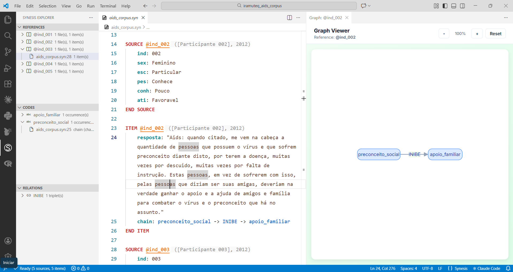

# Synesis para Usuários do IRaMuTeQ

Este tutorial é destinado a pesquisadores que já conhecem o IRaMuTeQ e querem entender como a linguagem Synesis pode complementar — e ampliar — seu fluxo de análise qualitativa.

**Você vai aprender a:**

- Estruturar um corpus diretamente em Synesis, desde a coleta
- Criar um template tipado com validação automática
- Exportar o corpus Synesis para o formato IRaMuTeQ
- Acrescentar camadas de anotação que alimentam análises além do IRaMuTeQ

**Pré-requisito:** familiaridade com o formato de corpus do IRaMuTeQ (linhas `****`, variáveis e modalidades).

---

## O Problema: o Corpus IRaMuTeQ é um Destino, não uma Fonte

O fluxo tradicional com o IRaMuTeQ começa fora do software: o pesquisador prepara um arquivo `.txt` com as linhas `****` — geralmente no Word ou em um editor de texto — e o insere para análise. Não há validação automática: um erro tipográfico em uma linha `****`, uma modalidade inexistente ou um campo faltante produzem ruído silencioso nos resultados.

Para corpus pequenos e pesquisadores solo, isso é administrável. Para corpus com centenas de textos, múltiplos codificadores ou fases de coleta distintas, torna-se um risco metodológico real.

O Synesis propõe uma inversão desse fluxo: o corpus é estruturado e mantido em Synesis desde o início, validado pelo compilador a cada edição, e exportado para IRaMuTeQ (ou qualquer outro destino) sob demanda. O arquivo `.txt` do IRaMuTeQ passa a ser um **artefato derivado** — gerado automaticamente a partir da fonte canônica — e não mais o ponto de partida.

---

## Parte 1 — O Corpus IRaMuTeQ e sua Estrutura

O IRaMuTeQ organiza corpus textuais com **linhas de comando** que precedem cada texto. Cada linha começa com `****` e lista variáveis no formato `*nome_valor`.

### Exemplo: corpus "aids"

Este corpus é formado pelas respostas à questão *"O que você pensa a respeito da Aids?"*, coletadas de 300 estudantes do ensino médio (Antunes, 2012). É um dos exemplos canônicos para uso da Classificação Hierárquica Descendente (CHD) com respostas curtas de questionários.

:::{.callout-note}
## Tutorial Iramuteq
Os exemplos deste tutorial foram extraídos do Manual de uso do software Iramuteq [@camargo2021].

O [repositório de estudos de caso do projeto](https://github.com/synesis-lang/case-studies/tree/main/Sociology/iramuteq_aids_corpus) contém versões prontas para uso
:::


As variáveis utilizadas são:

| Variável | Descrição | Modalidades |
|----------|-----------|-------------|
| `*ind`   | Indivíduo participante | 001 a 312 |
| `*sex`   | Sexo | 1 = masculino, 2 = feminino |
| `*esc`   | Tipo de escola | 1 = pública, 2 = particular |
| `*pes`   | Conhece soropositivo | 1 = conhece, 2 = não conhece |
| `*conh`  | Conhecimento sobre transmissão | 1 = bom, 2 = pouco |
| `*ati`   | Atitude frente ao soropositivo | 1 = favorável, 2 = neutra, 3 = desfavorável |

O corpus no formato IRaMuTeQ tem esta aparência:

```text
**** *ind_001 *sex_1 *esc_2 *pes_2 *conh_1 *ati_3
A aids é um vírus que tem que tomar muito cuidado. É importante conhecer
seu parceiro na hora de realizar atos sexuais. O vírus pode ser transmitido
por causa de um ato irresponsável, transar sem o uso de um preservativo,
ou através de um estupro.
**** *ind_002 *sex_2 *esc_2 *pes_1 *conh_2 *ati_1
Aids: quando citado, me vem na cabeça a quantidade de pessoas que possuem
o vírus e que sofrem preconceito diante disto, por terem a doença, muitas
vezes por descuido, muitas vezes por falta de instrução. Estas pessoas,
em vez de sofrerem com isso, pelas pessoas que diziam ser suas amigas,
deveriam na verdade ganhar o apoio e a ajuda de amigos e família para
combater o vírus e o preconceito que há no assunto.
**** *ind_003 *sex_2 *esc_2 *pes_2 *conh_2 *ati_3
Eu penso que é uma questão complicada, porque a pessoa fica mal e tem que
viver de remédios e tem medo de passar pra outra.
**** *ind_004 *sex_2 *esc_2 *pes_2 *conh_2 *ati_1
Uma dst, devido a falta de prevenção do casal. Hoje já existe tratamento,
porém pessoas que sofrem desta doença sofrem também de um grande preconceito
da sociedade.
**** *ind_005 *sex_2 *esc_2 *pes_2 *conh_2 *ati_1
É uma doença séria, que sofre muito preconceito. Mas que tem que passar a
ser respeitada mais, pois sendo cuidado e tendo proteção, não faz mal algum.
```

Cada bloco `****` é a unidade de análise — o IRaMuTeQ chama isso de **unidade de contexto inicial (UCI)**. Os valores após `****` são os metadados do respondente; o texto que segue é o conteúdo analisado.

---

## Parte 2 — Criando o Template Synesis

O template (`.synt`) é o coração do projeto Synesis. Ele declara os campos, seus tipos e suas regras — é a partir dele que o compilador valida cada anotação.

Para o corpus "aids", o template seria:

```synesis
TEMPLATE aids_corpus
# Pesquisa: Representações Sociais da Aids
# Escopo: Respostas à questão: "O que você pensa a respeito da Aids?" 
# Corpus: Respostas de 300 estudantes do ensino médio (Antunes, 2012). 

# ============================================
# CAMPOS DE SOURCE
# ============================================

SOURCE FIELDS
    REQUIRED ind, sex, esc, pes, conh, ati
END SOURCE FIELDS

FIELD ind TYPE TEXT
    SCOPE SOURCE
    DESCRIPTION "Identificador único do participante"
END FIELD

FIELD sex TYPE ENUMERATED
    SCOPE SOURCE
    DESCRIPTION "Sexo do participante"
    VALUES
        1: "Masculino"
        2: "Feminino"
    END VALUES
END FIELD

FIELD esc TYPE ENUMERATED
    SCOPE SOURCE
    DESCRIPTION "Tipo de escola"
    VALUES
        1: "Pública"
        2: "Particular"
    END VALUES
END FIELD

FIELD pes TYPE ENUMERATED
    SCOPE SOURCE
    DESCRIPTION "Conhece pessoa soropositiva"
    VALUES
        1: "Conhece"
        2: "Não conhece"
    END VALUES
END FIELD

FIELD conh TYPE ENUMERATED
    SCOPE SOURCE
    DESCRIPTION "Conhecimento sobre transmissão do HIV"
    VALUES
        1: "Bom conhecimento"
        2: "Pouco conhecimento"
    END VALUES
END FIELD

FIELD ati TYPE ENUMERATED
    SCOPE SOURCE
    DESCRIPTION "Atitude frente ao soropositivo"
    VALUES
        1: "Favorável"
        2: "Neutra"
        3: "Desfavorável"
    END VALUES
END FIELD

# ============================================
# CAMPOS DE ITEM
# ============================================
ITEM FIELDS
    REQUIRED resposta
END ITEM FIELDS

FIELD resposta TYPE QUOTATION
    SCOPE ITEM
    DESCRIPTION "Resposta à questão aberta sobre a Aids"
END FIELD
```

**Por que isso importa:** qualquer tentativa de registrar `ati: 4` ou `sex: 3` será rejeitada pelo compilador antes que os dados cheguem ao IRaMuTeQ. Com 300 participantes e múltiplos digitadores, esse tipo de verificação automática elimina uma categoria inteira de erros.

---

## Parte 3 — Estruturando o Corpus em Synesis

Com o template definido, cada respondente é registrado diretamente em Synesis como um par `SOURCE` + `ITEM`. Esta é a etapa de entrada de dados — o equivalente a preparar o arquivo `.txt` para o IRaMuTeQ, mas com validação automática a cada registro.

O corpus dos primeiros cinco participantes em Synesis:

```synesis
SOURCE @ind_001
    ind: 001
    sex: 1
    esc: 2
    pes: 2
    conh: 1
    ati: 3
END SOURCE

ITEM @ind_001
    resposta: A aids é um vírus que tem que tomar muito cuidado. É importante conhecer seu parceiro na hora de realizar atos sexuais. O vírus pode ser transmitido por causa de um ato irresponsável, transar sem o uso de um preservativo, ou através de um estupro.
END ITEM

SOURCE @ind_002
    ind: 002
    sex: 2
    esc: 2
    pes: 1
    conh: 2
    ati: 1
END SOURCE

ITEM @ind_002
    resposta: Quando citado, me vem na cabeça a quantidade de pessoas
    que possuem o vírus e que sofrem preconceito diante disto, por terem a doença, muitas vezes por descuido, muitas vezes por falta de instrução. Estas pessoas, em vez de sofrerem com isso, pelas pessoas que diziam ser suas amigas, deveriam na verdade ganhar o apoio e a ajuda de amigos e família para combater o vírus e o preconceito que há no assunto.
END ITEM

SOURCE @ind_003
    ind: 003
    sex: 2
    esc: 2
    pes: 2
    conh: 2
    ati: 3
END SOURCE

ITEM @ind_003
    resposta: Eu penso que é uma questão complicada, porque a pessoa fica mal e tem que viver de remédios e tem medo de passar pra outra.
END ITEM

SOURCE @ind_004
    ind: 004
    sex: 2
    esc: 2
    pes: 2
    conh: 2
    ati: 1
END SOURCE

ITEM @ind_004
    resposta: Uma dst, devido a falta de prevenção do casal. Hoje já existe tratamento, porém pessoas que sofrem desta doença sofrem também de um grande preconceito da sociedade.
END ITEM


SOURCE @ind_005
    ind: 005
    sex: 2
    esc: 2
    pes: 2
    conh: 2
    ati: 1
END SOURCE

ITEM @ind_005
    resposta: É uma doença séria, que sofre muito preconceito. Mas que tem que passar a ser respeitada mais, pois sendo cuidado e tendo proteção, não faz mal algum.
END ITEM
```

Cada vez que um novo registro é adicionado, o compilador verifica os valores contra o template. Tentar registrar `ati: 4` ou `sex: 3` gera um erro imediato — antes que o dado malformado entre no corpus.



---

## Parte 4 — Exportando para IRaMuTeQ

Com o corpus em Synesis, a exportação para o formato IRaMuTeQ é um único comando:

```bash
synesis export --format iramuteq corpus.synp --output aids_iramuteq.txt
```

O arquivo gerado é diretamente compatível com o IRaMuTeQ:

```text
**** *ind_001 *sex_1 *esc_2 *pes_2 *conh_1 *ati_3
A aids é um vírus que tem que tomar muito cuidado. É importante conhecer
seu parceiro na hora de realizar atos sexuais. O vírus pode ser transmitido
por causa de um ato irresponsável, transar sem o uso de um preservativo,
ou através de um estupro.
**** *ind_002 *sex_2 *esc_2 *pes_1 *conh_2 *ati_1
Aids: quando citado, me vem na cabeça a quantidade de pessoas que possuem
o vírus e que sofrem preconceito diante disto...
```

A correspondência entre os dois formatos é direta:

| Synesis | IRaMuTeQ |
|---------|----------|
| Bloco `SOURCE` | Linha `****` com variáveis |
| Campo `ind: 001` | `*ind_001` |
| Campo `sex: 1` | `*sex_1` |
| Campo `ati: 3` | `*ati_3` |
| Campo `QUOTATION` no `ITEM` | Texto que segue a linha `****` |

O arquivo `.txt` pode então ser aberto no IRaMuTeQ para CHD, análise de similitude, AFC, nuvem de palavras ou qualquer outra análise disponível no software — exatamente como no fluxo tradicional, mas com a garantia de que o corpus foi validado antes de chegar ali.

---

## Parte 5 — Synesis como Hub de Análise

A principal vantagem de manter o corpus em Synesis não é a exportação para IRaMuTeQ — é que o mesmo corpus pode alimentar múltiplos destinos simultaneamente:

```
Corpus Synesis (.synp + .bib + .syn + .synt)
        │
        ├──► Compilador valida contra template (.synt)
        │       │
        │       └── Erros reportados antes da análise
        │
        ├──► Exportação IRaMuTeQ (.txt)
        │       └── CHD, similitude, AFC, nuvem de palavras
        │
        ├──► Exportação CSV/JSON
        │       └── Jupyter, R, análise estatística
        ├──► synesis.load() no Jupyter, R
        │         ├──  df_metadata   → variáveis do SOURCE (sex, esc, ati...)
        │         ├── df_items      → textos + campos do ITEM
        │         ├── df_codes      → códigos atribuídos
        │         └── df_chains     → relações causais   
        │              
        ├──► Exportação REFI-QDA
        │       └── Atlas.ti, NVivo, MAXQDA
        │
        └──► Codificação adicional no próprio corpus
                ├── CODE    (categorias temáticas)
                ├── CHAIN   (relações causais entre conceitos)
                ├── MEMO    (notas analíticas do pesquisador)
                └── SCALE   (scores numéricos por item)
```

### Adicionando anotações ao corpus

Após rodar a CHD no IRaMuTeQ e identificar classes temáticas, o pesquisador pode voltar ao corpus Synesis e enriquecer as anotações. Por exemplo, marcar os textos que pertencem à Classe 2 da CHD com um código explícito:

```synesis
ITEM @ind_002
    resposta: Quando citado, me vem na cabeça a quantidade de pessoas
    que possuem o vírus e que sofrem preconceito diante disto

    chain: preconceito_social -> INIBE -> apoio_familiar
END ITEM
```

Essas anotações não interferem na exportação para IRaMuTeQ — mas ficam disponíveis para exportação para Neo4j, para análise de co-ocorrência de códigos em Jupyter, ou para uma segunda rodada no IRaMuTeQ com variáveis adicionais derivadas da codificação.

### Acesso programático via API

O corpus compilado também pode ser carregado diretamente em um notebook Jupyter:

```python
import synesis

corpus = synesis.load("aids.synp")

# DataFrame de metadados dos participantes
df_meta = corpus.sources()

# DataFrame de textos com metadados vinculados
df_items = corpus.items()

# DataFrame de códigos atribuídos
df_codes = corpus.codes()

# DataFrame de cadeias causais
df_chains = corpus.chains()
```

Cada `DataFrame` já respeita os tipos declarados no template — `ati` chega como inteiro com valores 1, 2 ou 3; nunca como string ou valor fora do intervalo.

---

## Parte 6 — Synesis como Camada de Governança

Para pesquisadores solo com corpus pequenos, o IRaMuTeQ sozinho é suficiente. O Synesis passa a fazer diferença em três cenários:

**Corpus volumosos.** Com 300 ou mais participantes, a probabilidade de erro de digitação nas linhas `****` é alta. O compilador Synesis captura esses erros antes da análise, eliminando o risco de resultados contaminados por dados malformados.

**Trabalho em equipe.** Quando múltiplos pesquisadores digitam ou codificam o mesmo corpus, o template funciona como contrato: todos os campos, todos os valores permitidos e todas as relações declaradas estão em um único arquivo versionável. Discrepâncias entre codificadores são detectadas na compilação, não na reunião de orientação.

**Pesquisa longitudinal ou multi-etapas.** Quando o corpus cresce ao longo do tempo — novas coletas, novos participantes, novas variáveis — o Synesis mantém a integridade entre versões. O histórico de decisões ontológicas pode ser documentado diretamente nos arquivos `.syno` com comentários datados:

```synesis
# DECISÃO 2026-03-01: separamos "preconceito" em dois conceitos após
# identificar distinção entre preconceito declarado e comportamento relatado
# nas entrevistas 45-60.

ONTOLOGY preconceito_declarado
    descricao: "Expressão verbal de atitude discriminatória"
    grupo: dimensao_social
END ONTOLOGY

ONTOLOGY preconceito_comportamental
    descricao: "Ação discriminatória relatada pelo participante"
    grupo: dimensao_social
END ONTOLOGY
```

---

## Resumo

| Aspecto | IRaMuTeQ | Synesis + IRaMuTeQ |
|---------|----------|--------------------|
| Validação de corpus | Nenhuma | Compilador verifica tipos e modalidades |
| Fonte canônica dos dados | Arquivo `.txt` | Corpus `.syn` + template `.synt` |
| Destinos de exportação | Resultados internos | IRaMuTeQ, CSV, JSON, REFI-QDA, Neo4j |
| Anotação interpretativa | Não suportada | CODE, CHAIN, MEMO, SCALE |
| Trabalho em equipe | Manual | Template como contrato compartilhado |
| Acesso programático | Não disponível | `synesis.load()` no Jupyter/R |

O IRaMuTeQ continua sendo a ferramenta indicada para CHD, análise de similitude e AFC. O Synesis não substitui essas análises — ele governa o corpus que as alimenta, e abre o mesmo corpus para análises que o IRaMuTeQ não realiza.

---

## Próximos Passos

- [Como Definir uma Ontologia](definir_ontologia.qmd) — criar vocabulário de códigos para anotação
- [Como Criar Chains](criar_chains.qmd) — declarar relações causais entre conceitos
- [Exportações Disponíveis](exportacoes.qmd) — referência completa dos formatos de saída
- [Referência da Linguagem](../reference/guia_referencia.qmd) — especificação formal da sintaxe Synesis

---

**Ficou com dúvidas?** Consulte [GitHub Discussions](https://github.com/synesis-lang/synesis/discussions) ou abra uma issue no repositório.

---

## Referências
